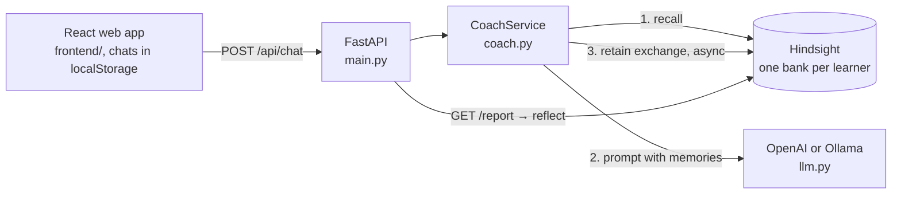

# LearnLoop: an AI tutor that remembers you

LearnLoop is a programming tutor for beginners that **learns about each student over time**.
It remembers what you struggled with last week, what project you're building and how you like
things explained, then uses that to personalise every answer and to write you a progress report.

Long-term memory is powered by [Hindsight](https://github.com/vectorize-io/hindsight), an agent
memory system, instead of plain chat history or a basic RAG vector store. The tutor's reasoning is
powered by any OpenAI-compatible model: OpenAI's `gpt-5-mini`, or a free model running on your own
computer with [Ollama](https://ollama.com).

```
You (3 weeks ago): "My factorial function crashes with RecursionError..."
You (today):       "Can you give me something to practise?"
LearnLoop:         "Last time recursion base cases tripped you up, so let's do one short
                    exercise on that. Here's a 4-line example you can run..."
```

The web app is a React + TypeScript chat interface in the style of other AI chat tools:

- **Chats** in a sidebar, grouped by date, with search, rename and delete. New chat: `Ctrl + Shift + O`.
- **Replies** rendered as Markdown with highlighted code blocks and a Copy button; Stop, Retry and Regenerate.
- **Memory you can see**: the notes a reply used appear under it like highlighter marks. A memory
  window lists everything LearnLoop remembers and writes a progress report.
- **Settings**: light/dark/system theme, text size, Enter-to-send, learner profile, memory on/off,
  how much of the chat to send along, and export/import/delete for your chats.
- **No chat database, by design**: chats and settings live in your browser's local storage, until you
  delete them or clear your browser data. Long-term memory is separate and lives in Hindsight.

## Why memory instead of chat history or RAG?

| Approach | What the agent knows next week | Problem |
|---|---|---|
| **Chat history** | Only the current conversation | Forgets everything when the tab closes; history grows until it no longer fits in the context window |
| **RAG (vector search over old chats)** | Chunks of text that *look similar* to the question | Retrieves raw transcripts, not facts. "What did I struggle with?" doesn't look like "RecursionError: maximum depth exceeded" |
| **Hindsight memory** | Extracted facts, entities, timelines and consolidated observations | Needs a memory server and uses extra LLM calls in the background |

Hindsight turns each conversation into structured facts (*"learner struggled with recursion base
cases, 14 days ago"*). It then retrieves them with four strategies in parallel (semantic, keyword,
entity graph, temporal) and can **reflect** across all of them to answer questions like *"what
should this learner study next?"*

## Architecture



Each chat turn runs **recall → think → reply → retain**:

1. **Recall**: fetch memories relevant to the learner's message from *their* bank.
2. **Think**: the model receives long-term memory (in the system prompt) plus short-term memory (recent turns of the current chat, sent by the browser).
3. **Reply**: the answer goes back to the browser, along with the memories that were used, for transparency.
4. **Retain**: the exchange is stored asynchronously, so the learner never waits on memory extraction.

Design decisions, alternatives and trade-offs are in [docs/DESIGN.md](docs/DESIGN.md).

## Quick start

You need **Docker Desktop**, plus one of these for the AI model:

- **Option A, OpenAI (paid):** an [OpenAI API key](https://platform.openai.com/api-keys) with credits.
- **Option B, Ollama (free, runs on your computer):** install [Ollama](https://ollama.com), then run
  `ollama pull qwen3:4b-instruct` (about 2.5 GB). No account or key needed.

```bash
cp .env.example .env          # then follow Option A or Option B inside it
docker compose up --build
```

With Ollama, answers depend on your hardware: expect a few seconds to a minute per reply on a laptop,
and a small model gives simpler answers than `gpt-5-mini`.

- App: http://localhost:8000
- API docs (auto-generated, interactive): http://localhost:8000/docs
- Hindsight memory explorer: http://localhost:9999

The Docker build also builds the React app (see the two stages in `Dockerfile`), so there's nothing
else to install. Give the demo learner some history, then chat as `demo-student` and open
**What LearnLoop remembers** from the sidebar:

```bash
docker compose exec app python -m scripts.seed_demo
```

### Local development (hot reload)

Changing the web app: keep the Docker stack running (it serves the API on :8000) and start Vite,
which reloads the page on every save and forwards `/api` calls to :8000:

```bash
cd frontend
npm install
npm run dev        # open http://localhost:5173
```

Changing the Python server: run Hindsight in Docker and the API on your machine (Windows shown;
use `source .venv/bin/activate` on macOS/Linux):

```powershell
docker compose up hindsight -d
python -m venv .venv
.venv\Scripts\activate
pip install -r requirements-dev.txt
uvicorn app.main:app --reload
```

`npm run build` in `frontend/` writes the production web app into `app/static/`, which FastAPI serves
at http://localhost:8000. A guide to the web app's code is in [docs/FRONTEND.md](docs/FRONTEND.md).

## API

| Method | Path | What it does |
|---|---|---|
| `POST` | `/api/chat` | Chat turn. Body: `user_id`, `message`, optional `history`, `use_memory` |
| `GET` | `/api/users/{user_id}/memories` | Everything the tutor remembers about a learner (`?q=` ranks by relevance instead) |
| `DELETE` | `/api/users/{user_id}/memories` | Delete a learner's long-term memory |
| `GET` | `/api/users/{user_id}/report` | Structured progress report built with Hindsight `reflect` |
| `GET` | `/api/info` | Server facts the web app shows: version, model, history limit |
| `GET` | `/healthz` | Liveness, plus whether the memory service is reachable |

## Quality

```bash
pytest -q                     # 35 server tests, run offline using fakes (no API key, no server)
ruff check . && ruff format --check .
python -m scripts.eval_memory # measures reply quality with memory ON vs OFF (needs the live stack)

cd frontend
npm test                      # 38 web app tests (Vitest + Testing Library), with a fake server
npm run lint && npm run typecheck
```

CI (`.github/workflows/ci.yml`) runs all of it, plus a production build and a Docker build, on every push.

**Resilience:** if Hindsight is down, the tutor still answers without personalisation, and the UI
tells the user. If OpenAI is down, the API returns a clear `502` instead of crashing. If the API key
is missing, the app refuses to start and says so.

## Project layout

```
app/
  main.py      HTTP routes, app factory, dependency wiring
  coach.py     The agent loop: recall → think → reply → retain; progress reports
  memory.py    MemoryStore interface + Hindsight implementation (one bank per learner)
  llm.py       LLM interface + OpenAI implementation
  prompts.py   Prompt templates (memories are escaped to resist prompt injection)
  schemas.py   Validated request/response models
  config.py    Typed settings from environment variables
  static/      The built web app (generated by `npm run build`; not in git)
frontend/      React + TypeScript web app (Vite); see docs/FRONTEND.md
tests/         Unit + API tests with fake memory and LLM
scripts/       Demo seeding and the memory-vs-no-memory evaluation
docs/          Design doc, web app guide and learning path
```

## Cost

With Ollama (Option B) everything runs on your computer and costs nothing.

With OpenAI (Option A), every chat turn is one OpenAI call for the reply plus background calls inside
Hindsight to extract facts (also on `gpt-5-mini` by default). The eval script makes about 10 OpenAI
calls. Set a monthly budget limit in your OpenAI account settings while you experiment.
`LEARNLOOP_EFFORT=minimal` gives cheaper, faster replies.

## License

MIT
