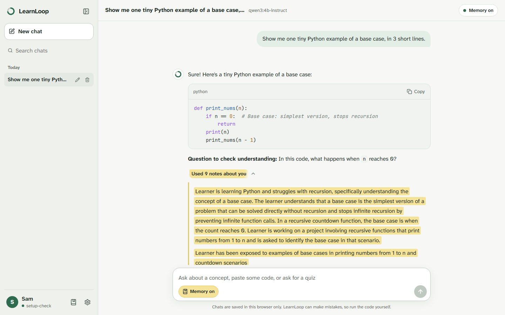
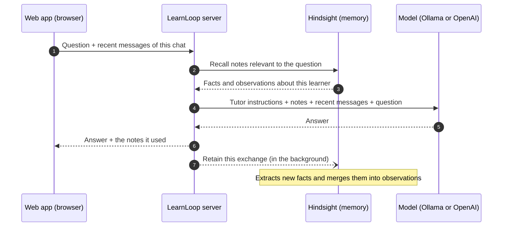
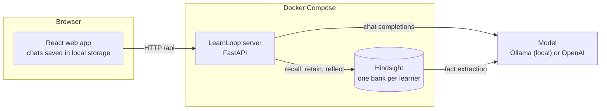
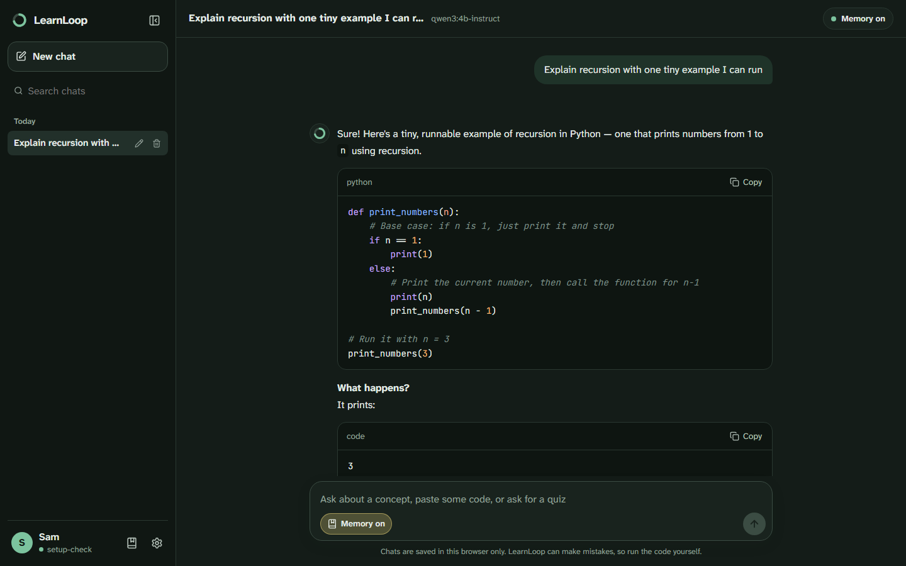
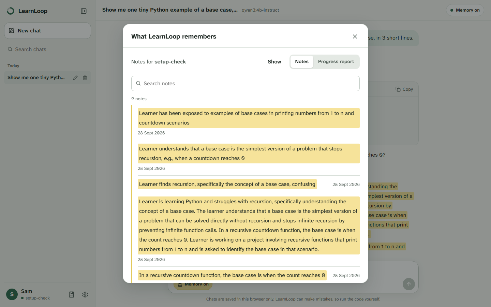
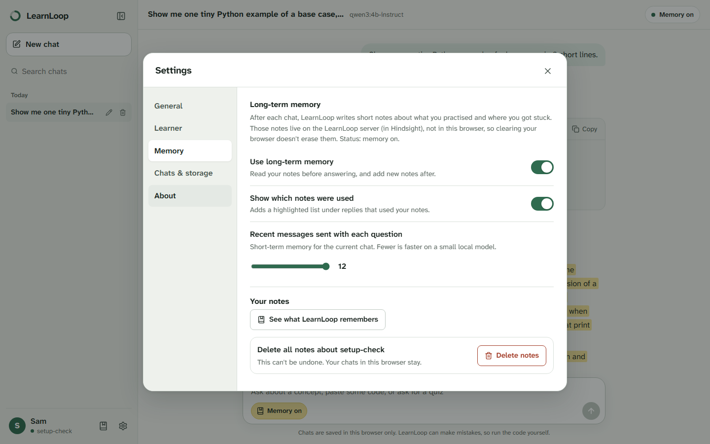
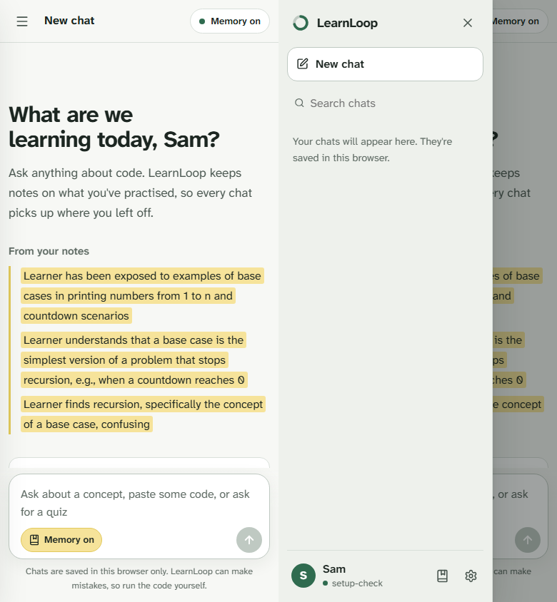

<p align="center">
  
</p>

<h1 align="center">LearnLoop</h1>

<p align="center">
  <strong>An AI programming tutor that remembers you.</strong><br />
  It keeps notes on what you practise, where you get stuck and how you like to learn,<br />
  so every conversation picks up where the last one left off.
</p>

<p align="center">
  <a href="https://github.com/satyaidk/emergent-loop/actions/workflows/ci.yml"></a>
  
  
  
  
</p>

<p align="center">
  <a href="#quick-start">Quick start</a> ·
  <a href="#how-it-works">How it works</a> ·
  <a href="#features">Features</a> ·
  <a href="docs/GETTING_STARTED.md">Run it</a> ·
  <a href="docs/DESIGN.md">Design doc</a>
</p>



## What is LearnLoop?

Most AI chat tools forget you the moment a conversation ends. Ask about recursion today, come back next
week, and you start from zero: it doesn't know what confused you, what you already mastered or what
you're building.

LearnLoop works like a good teacher with a notebook. **Before answering, it reads its notes about you.
After you talk, it writes new ones.** Those notes shape every answer: it skips what you know, revisits
what tripped you up, and explains things the way you learn best.

```
You (two weeks ago): "My factorial function crashes with RecursionError."
You (today, in a brand-new chat):  "Can you give me something to practise?"
LearnLoop:  "Last time the base case tripped you up, so here's one short exercise on exactly that..."
```

## What makes it different

**Memory, not transcripts.** Most "memory" in chat apps means replaying old messages, or searching them
for similar-looking text (known as RAG). LearnLoop uses [Hindsight](https://github.com/vectorize-io/hindsight),
an agent memory system that turns conversations into **facts about the learner**, links them by topic
and time, and merges them into longer-lasting observations.

| Approach | What the tutor knows next week | The catch |
|---|---|---|
| Chat history | Only the current conversation | Forgotten when the chat ends; grows until it no longer fits the model |
| RAG over old chats | Chunks of old text that *look* similar to the question | "What did I struggle with?" doesn't look like "RecursionError: maximum depth exceeded" |
| **LearnLoop (Hindsight)** | Facts, timelines and patterns about *you* | Needs a memory service and some background processing |

**Memory you can see and control.** Replies show which notes they used, highlighted like a student's
highlighter pen. A memory window lists everything LearnLoop knows about you, and one button deletes it.

**Free and private, on your own computer.** LearnLoop runs on a local model through
[Ollama](https://ollama.com): no account, no API key, no cost, and your conversations don't leave your
machine. OpenAI works too, with one setting.

**Built like production software.** A layered, tested Python server; a typed React web app; 97
automated tests; continuous integration; one-command Docker setup; and graceful handling of every
service that can fail.

## Features

**Learning**
- Explanations with small runnable code examples, followed by a quick question to check understanding
- A **progress report**, written from memory: your strengths, what you struggle with, and what to study next
- **Suggested questions in every chat**: after each answer, three follow-ups about that chat's topic,
  kept per chat, so a chat about SQL never suggests something from a chat about recursion
- A new chat opens with starter ideas drawn from what you've been learning, refreshed as you learn more

**Memory**
- Long-term memory for each learner, kept in its own Hindsight *bank* so learners never see each other's notes
- Recall before every answer; new notes are written in the background, so you never wait for them
- "Used 3 notes about you" under each reply, a searchable list of every note, and one-click deletion
- Short-term memory: recent messages of the current chat, with an adjustable amount
- A memory on/off switch right in the message box

**Chat**
- Multiple chats in a sidebar, grouped by date, with search, rename and delete
- Markdown replies with syntax-highlighted code and a Copy button
- Stop, Try again and Regenerate; Enter to send, Shift + Enter for a new line, Ctrl + Shift + O for a new chat
- Light, dark and system themes, three text sizes, and a layout that works on phones

**Your data**
- Chats and settings are saved in your browser, with export and import for backups
- Learner IDs let one person keep separate profiles, or several people share a computer
- Clearing your browser removes chats but not LearnLoop's notes; each has its own delete button

## How it works

Every question runs the same loop: **recall, think, reply, retain.**



1. **Recall.** Hindsight searches the learner's notes four ways at once (meaning, keywords, linked
   topics and time) and ranks the results for this exact question.
2. **Think.** The model gets tutoring instructions, the relevant notes and the recent messages of the
   current chat. Notes are passed as data, never as instructions, which guards against prompt injection.
3. **Reply.** The answer goes back to the browser together with the notes it used, so the learner can
   see why it's personal.
4. **Retain.** The exchange is handed to Hindsight in the background. It extracts durable facts, such as
   "struggles with recursion base cases", and folds them into what it already knows.

LearnLoop keeps two kinds of memory, in two places:

| | Short-term memory | Long-term memory |
|---|---|---|
| **What** | The recent messages of the current chat | Facts about the learner, across every chat |
| **Where** | Your browser | Hindsight, on the server |
| **Deleted when** | You delete the chat or clear browser data | You press **Delete notes** in Settings |

## Architecture



| Layer | Technology | Role |
|---|---|---|
| Web app | React 19, TypeScript, Vite | Chat interface, settings, local storage |
| Server | Python 3.11, FastAPI, Pydantic | The recall, think, reply, retain loop; validation; the API |
| Memory | [Hindsight](https://github.com/vectorize-io/hindsight) | Fact extraction, multi-strategy recall, reflection |
| Model | Ollama (`qwen3:4b-instruct`) or OpenAI (`gpt-5-mini`) | Answers, through one OpenAI-compatible client |
| Delivery | Docker Compose, multi-stage Dockerfile | One command starts everything |
| Quality | pytest, Vitest, Testing Library, ruff, oxlint, GitHub Actions | 97 tests, linting and builds on every push |

The design decisions, the alternatives that were considered and the known risks are in the
[design doc](docs/DESIGN.md).

## Screenshots

| Dark mode | What LearnLoop remembers |
|---|---|
|  |  |
| **Settings** | **On a phone** |
|  |  |

## Engineering highlights

- **Testable by design.** The server talks to memory and to the model through small interfaces.
  Tests swap in fakes, so 50 server tests run in seconds with no network, key or model.
- **Graceful degradation.** If the memory service is down, the tutor still answers (without
  personalisation) and says so. If the model is unreachable, the web app shows the real reason and a
  retry button. A missing key stops startup with a clear message.
- **Suggestions at no extra cost.** Follow-up questions are written in the same model call as the
  answer and cut off by the server, so they add no waiting time, even on a small local model.
- **Security basics.** Learner IDs are validated before they touch storage; memories are escaped and
  delimited in prompts; replies are rendered without raw HTML; the container runs as a non-root user.
- **A considered web app.** One reducer for every state change, a versioned storage format, and code
  splitting that cut the first download from 593 KB to 271 KB. Keyboard and screen-reader friendly.
- **Tested like a user.** 47 web app tests type into the real interface against a fake server.
- **Continuous integration.** Lint, type checks, tests, a production build and a Docker build run on
  every push and pull request.

## Quick start

You need **Docker Desktop**, and either **[Ollama](https://ollama.com)** (free, local) or an OpenAI API key.

```bash
git clone https://github.com/satyaidk/learnloop.git
cd learnloop
ollama pull qwen3:4b-instruct        # skip if you use OpenAI
cp .env.example .env                 # pick the Ollama or OpenAI option inside
docker compose up --build
```

Open **http://localhost:8000**. The full guide, with development mode, the API reference, tests and
troubleshooting tips, is in **[docs/GETTING_STARTED.md](docs/GETTING_STARTED.md)**.

## Documentation

| Guide | What's inside |
|---|---|
| [Getting started](docs/GETTING_STARTED.md) | Installing, running and developing; API reference; tests; costs |
| [Design doc](docs/DESIGN.md) | Goals, alternatives considered, failure modes and risks |
| [Web app guide](docs/FRONTEND.md) | How the React app is organised, file by file |
| [Learning path](docs/LEARNING_PATH.md) | A step-by-step plan to understand and extend the project |

## Project structure

```
app/          Python server: API routes, the tutoring loop, memory and model clients
frontend/     React + TypeScript web app
tests/        Server tests (the web app's tests sit next to its code in frontend/src)
scripts/      Demo data and the memory-on vs memory-off evaluation
docs/         Guides, design doc and screenshots
```

## Limitations and roadmap

- **No user accounts yet.** A learner ID is trusted as given: fine on your own computer, but
  authentication comes before any public deployment.
- **Chats stay in one browser.** They don't sync between devices; export and import cover backups.
- **Replies aren't streamed yet.** On a small local model, a reply can take up to a minute or two while
  memory is being written.

Next up: streaming replies, authentication, an LLM-judged evaluation of memory quality, and a hosted
demo. See the [learning path](docs/LEARNING_PATH.md) for the full plan.

## Acknowledgements

Long-term memory by [Hindsight](https://github.com/vectorize-io/hindsight) from Vectorize. Local models
through [Ollama](https://ollama.com), running Qwen by Alibaba. Code highlighting by highlight.js; icons by Lucide.

## License

MIT
